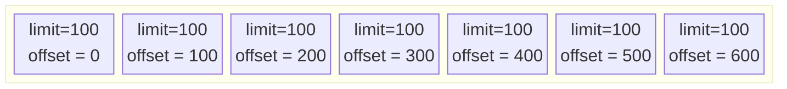
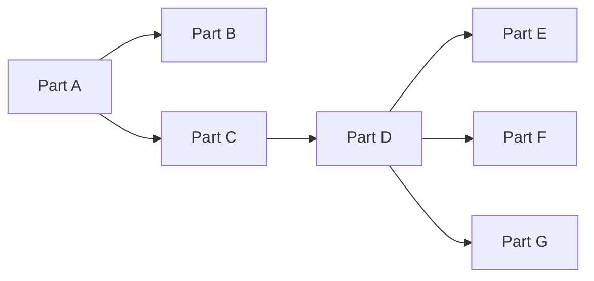
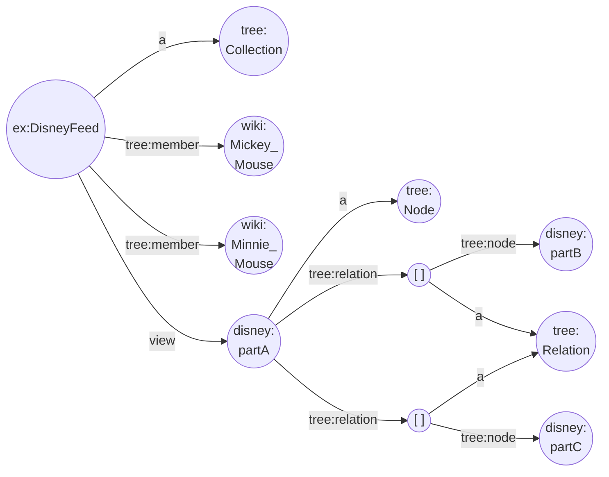
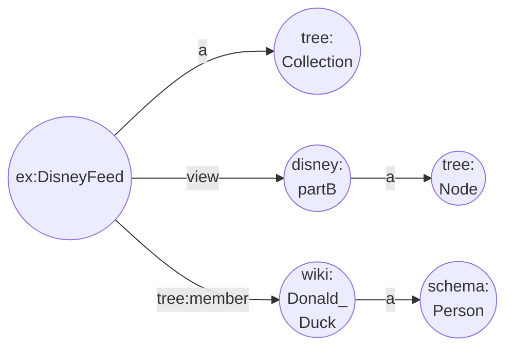
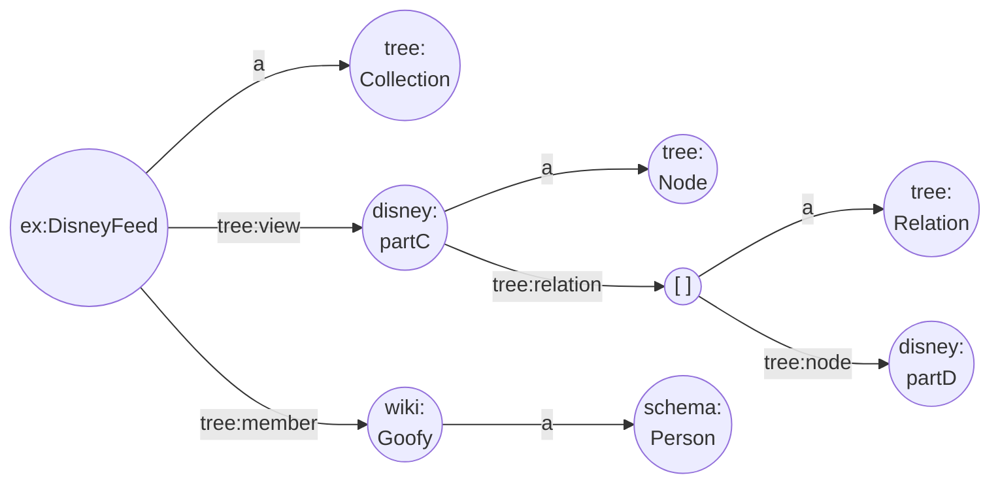

# TREE Partitioning Basics
Because data sets can be large or even huge, an API allows to retrieve data items in chunks, which are equally sized subsets of a data set.

Typically, an API call allows sorting the resulting (whole or partial) data set and to pass two parameters to facilitate this _pagination_: a _limit_ (chunk/page size) and an _offset_ (chunk/page starting point). To retrieve the resulting data items without duplicates or missing data items, you need to do subsequent calls to such an API and keep the limit constant and increment the offset by the chosen limit. Basically, you need to calculate the correct starting point to get the next chunk of data items. You need to repeat this until less data items are returned than the limit. Although, this is a very flexible way to get a data set, the data publisher must monitor these requests and take measures (database indexes, etc.) to allow for a smooth experience on the data client side. This increases the cost on the data publisher's side.


Fig 10. Retrieving data set using chunks.

## Fetching a TREE
The TREE specification takes a different approach: any collection that does not fit in one HTTP response must be split into a collection of _nodes_ (pages) which are linked to each other in the content itself. You can retrieve such a collection by requesting a _root node_ (starting page). The response contains a limited number of members (data items) and zero or more links to _subsequent nodes_ (non-root pages). You then request each link referring to another node and repeat this recursively for all nodes until all responses contain no more links.


Fig 1. Retrieving data set using TREE.

In this example we start from part A, find the links to parts B and C and follow them both. Part B does not contain any links, so there we are done, but part C has a link to part D, so we continue by following the link to D where we find a link to parts E, F and G. After we visit parts E, F and G, which are all dead ends, we are done.

The TREE approach allows us to retrieve all parts as well, but has the benefit that you obtain the _explicit link_ to the next subset of data items and you do not need to calculate it. Because a part can link to many other parts, you can create a hierarchical search _tree_. This is where the TREE specification gets its name from. In addition, since a part can link to many parts, we are not restricted in retrieving the data in a linear way but we can benefit from _retrieving the nodes in a parallel way_.

> [!NOTE]
> The data publisher decides on the amount of data items returned in each response. This is intentional to keep data publisher's costs better under control. In the end it also does not matter what the chunk size is, as long as you get all the data items that you need.

## Nodes and Relations
The TREE specification defines a `tree:Node` type (a _node_) to have a `tree:relation` predicate of type `tree:Relation` (a _relation_). A relation has a `tree:node` predicate that is a link (URL) to another node.

A `tree:Collection` has a predicate `tree:view` that points to the current `tree:Node` (the part we requested).

> [!TIP]
> Because the `tree:view` entity is by definition a `tree:Node` you do not need to include a triple specifying this type (i.e. you can drop the triple `<> a tree:Node`). Vice versa, because a page can contain at most one `tree:Node` you can assume that this entity is the `tree:view` of the collection, so you can omit that triple (i.e. `<collection> tree:view <>`). However, if the collection response does not contain a `tree:Node` then a `<collection> tree:view <root-node>` triple is required in order for a data client to be able to retrieve the root node. Obviously, you need to provide at least one of the triples to allow determining both the collection and node entities. However, best practice is to include both triples.

> [!TIP]
> A collection can contain any number of views, therefore we can create different structures that allow finding all the data items in different ways. Obviously, this requires a data client to select the appropriate view to follow, e.g. based on the SHACL shape.

> [!TIP]
> A _root node_ can also contain a `tree:viewDescription` property, which is an entity that further describes a TREE view, e.g. with a `dcat:Distribution` predicate (see [catalog information](https://semiceu.github.io/DCAT-AP/releases/3.0.0/)).
> 
```
@prefix tree:   <https://w3id.org/tree#> .
@prefix wiki:   <http://en.wikipedia.org/wiki/> .
@prefix schema: <http://schema.org/> .
@prefix ex:     <http://example.org/> .
@prefix disney: <http://example.org/DisneyFeed#> .

ex:DisneyFeed a tree:Collection ;
  tree:view disney:partA ;
  tree:member wiki:Mickey_Mouse, wiki:Minnie_Mouse .

disney:partA a tree:Node ;
  tree:relation [ a tree:Relation; tree:node disney:partB ] .
  tree:relation [ a tree:Relation; tree:node disney:partC ] .

wiki:Mickey_Mouse a schema:Person .

wiki:Minnie_Mouse a schema:Person .
```


Fig 2. Tree node A (starting node)

```
@prefix tree:   <https://w3id.org/tree#> .
@prefix wiki:   <http://en.wikipedia.org/wiki/> .
@prefix schema: <http://schema.org/> .
@prefix ex:     <http://example.org/> .
@prefix disney: <http://example.org/DisneyFeed#> .

ex:DisneyFeed a tree:Collection ;
  tree:view disney:partB;
  tree:member wiki:Donald_Duck .

disney:partB a tree:Node .

wiki:Donald_Duck a schema:Person .
```


Fig 3. Tree node B

```
@prefix tree:   <https://w3id.org/tree#> .
@prefix wiki:   <http://en.wikipedia.org/wiki/> .
@prefix schema: <http://schema.org/> .
@prefix ex:     <http://example.org/> .
@prefix disney: <http://example.org/DisneyFeed#> .

ex:DisneyFeed a tree:Collection ;
  tree:view disney:partC ;
  tree:member wiki:Goofy .

disney:partC a tree:Node ;
  tree:relation [ a tree:Relation; tree:node disney:partD ] .
  
wiki:Goofy a schema:Person .
```


Fig 4. Tree node C

## Summary
> [!IMPORTANT]
> A _node_ is _a page containing data items and relations_. A _relation_ is a _reference to a other node_ possibly containing more data items. A _root node_ is the starting node from which all data items for a data set can be retrieved. All other nodes are _subsequent nodes_. A _search form_ allows to jump to subsequent nodes offering direct access to a subset of the collection.

---
<p align="right">Next: <a href="G-tree-partitioning-types.md">TREE Partitioning Types</a></p>
