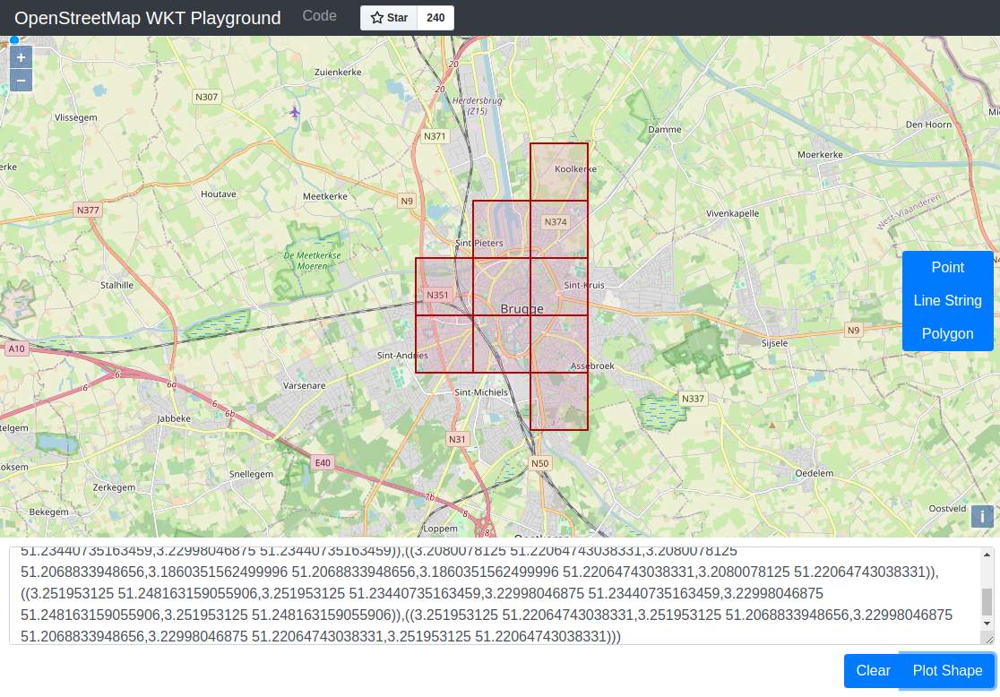

# TREE Geo-spatial View
In many domains, we need to find a subset of the data set filtered by geo-spatial properties. The TREE specification does not describe an API for geo-spatial querying but does provide a way to search the buckets of interest.

By examining the relations and their labels (`tree:path` and `tree:value`) a TREE client can prune the search tree, that is, ignore all node links not of interest. We can use the `tree:GeospatiallyContainsRelation` to group our data items according to their geo-spatial predicate(s).

To use this relation, we need to use a predicate of the data item (or from an inner blank node) that contains a literal of type `geosparql:asWKT` for the `tree:path`. A [well-known text representation (WKT)](https://en.wikipedia.org/wiki/Well-known_text_representation_of_geometry) is a way to express a geometry (a point, a line, a multi-line, a polygon, etc.). The `tree:value` for this relation must contain a geometry figure which _contains_ ([geof:sfContains](https://docs.ogc.org/is/22-047r1/22-047r1.html#_simple_features_relation_family)) the geometry of the data items. Typically, we use a square polygon that represents the bounding box of a [tile](https://en.wikipedia.org/wiki/Tiled_web_map) at some zoom level. This allows us to create a hierarchical search tree.

A tiling system basically means that we start with the world all in one tile. We then divide that top-level tile into four smaller tiles of equal size by dividing both axis in two equal parts. We then sub-divide the tiles at this level in the same way and keep doing that until we have a tiles at the appropriate [zoom level](https://wiki.openstreetmap.org/wiki/Slippy_map_tilenames#Zoom_levels). Typically, a zoom level between 13 and 15 is adequate to refer to parts of a city or a small community.

> [!NOTE]
> Creating a geo-spatial view by hand is pretty hard, so here is an example of an [existing geo-spatial view](https://brugge-ldes.geomobility.eu/observations/by-location). If you follow the URL to its [root node](https://brugge-ldes.geomobility.eu/observations/by-location?tile=0/0/0) you will see ten `tree:GeospatiallyContainsRelation` relations, each defining a bounding box for a tile at level 14. The first two relations look like this (changed a bit for readability):

```
@prefix geosparql: <http://www.opengis.net/ont/geosparql#> .
@prefix rdf:       <http://www.w3.org/1999/02/22-rdf-syntax-ns#> .
@prefix tree:      <https://w3id.org/tree#> .

</by-location?tile=0/0/0>
        rdf:type        tree:Node ;
        tree:relation   [ rdf:type    tree:GeospatiallyContainsRelation ;
                          tree:node   </observations/by-location?tile=14/8338/5469> ;
                          tree:path   geosparql:asWKT ;
                          tree:value  "<http://www.opengis.net/def/crs/OGC/1.3/CRS84> POLYGON ((3.22998046875 51.2206474303833, 3.22998046875 51.20688339486561, 3.2080078125 51.20688339486561, 3.2080078125 51.2206474303833, 3.22998046875 51.2206474303833))"^^geosparql:wktLiteral
                        ] ;
        tree:relation   [ rdf:type    tree:GeospatiallyContainsRelation ;
                          tree:node   </observations/by-location?tile=14/8339/5470> ;
                          tree:path   geosparql:asWKT ;
                          tree:value  "<http://www.opengis.net/def/crs/OGC/1.3/CRS84> POLYGON ((3.251953125 51.20688339486561, 3.251953125 51.19311524464586, 3.22998046875 51.19311524464586, 3.22998046875 51.20688339486561, 3.251953125 51.20688339486561))"^^geosparql:wktLiteral
                        ] ;
...
```
> [!NOTE]
> The WKT literal defines a [Spatial Reference System (SRS)](https://en.wikipedia.org/wiki/Spatial_reference_system) to be [CRS84](https://en.wikipedia.org/wiki/World_Geodetic_System#WGS84) which is the default SRS for WKT.

We can visualize the tiles in our example:



Fig 1. Tiles visualized

## Summary
A _geo-spatial view_ allows us to create a _hierarchical structure_ where we can _filter a data set based on containment of data items in a geo-spatial area_, usually a polygon.

---
<p align="right">Next: <a href="J-reference-based-view.md">TREE Reference-based View</a></p>
